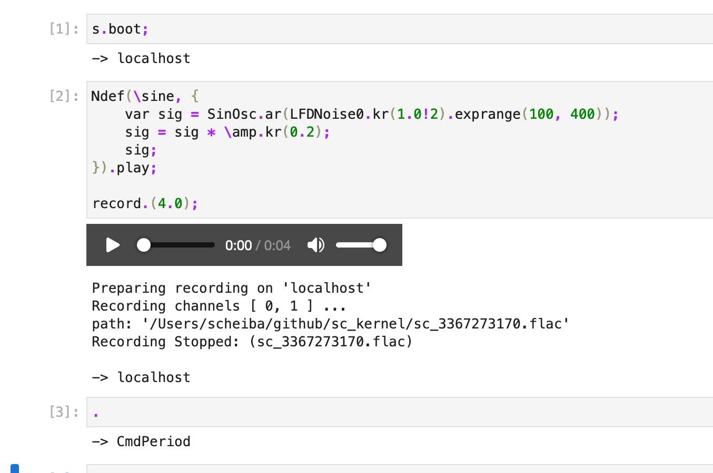

# Supercollider Jupyter Kernel

This kernel allows running [SuperCollider](https://supercollider.github.io/) Code in a [Jupyter](https://jupyter.org/) environment.


## Installation

Please make sure one has installed [SuperCollider](https://supercollider.github.io/) and
[Python 3 with pip](https://realpython.com/installing-python).

* To install the kernel for Jupyter execute

  ```shell
  pip3 install sc-kernel
  ```
  
  This will also install [Jupyter Lab](https://jupyter.org/) if it is not already installed on the system.

* Start a new Jupyter Lab instance by executing `jupyter lab` in a console.

* Click on the SuperCollider icon

If one has not installed SuperCollider in the default location, one has to set a environment variable
called `SCLANG_PATH` which points to the sclang executable.

To uninstall the kernel execute

```shell
jupyter kernelspec uninstall sc_kernel
```

## Usage

### Stop sound

Currently the `Cmd + .` command is not binded. Instead create a new cell with a single dot
  
```
.
```

and execute this cell. This will transform the command to `CommandPeriod.run;` which is what is actually called on the `Cmd + .` press in the IDE.

 
 ### Recording
 
`sc_kernel` provides an easy way to record audio to the local directory and store it in the notebook
so one can later share the notebook with the sound examples embedded.

Assuming one has started the server, simply execute

```supercollider
%% record "my_file.flac"

{SinOsc.ar(SinOsc.ar(200)*200)*0.2!2}.play;
```

to start the recording.

To stop the recording, simply stop the Server recording via

```supercollider
s.stopRecording;
```

If one has chosen FLAC or WAV as file format, one will see a playback menu for the file within the notebook.



If an relative path is provided as filename it will be put relative to the folder where `jupyter lab` was executed.
If an absolute path is given the output will be directed to the absolute path.

Keep in mind that **good browser support only exists for FLAC** and with WAV the seeking does not work.
The standard recording format of supercollider AIFF is not supported by browsers.

### Autocomplete

Simply push `Tab` to see available autocompletions.

### Documentation

To display the documentation of a Class, simply prepend a `?` to it and execute it, e.g.

```supercollider
?SinOsc
```

## Development

Any PR is welcome! Please state the changes in an Issue.
To contribute, please

* Fork the repository and clone it to a local directory

* If one wants to add the kernel to an existing Jupyter installation one can execute

  ```shell
  jupyter kernelspec install sc_kernel
  ```

  and run `jupyter lab` from within the cloned directory as
  we need to have access to `sc_kernel`.

* Run `./run_tests.sh` and make a PR :)
  The tests often run into a pexpect timeout for some reason.
  They should pass if they are run alone.

## Maintainers

* [Dennis Scheiba](https://dennis-scheiba.com)
