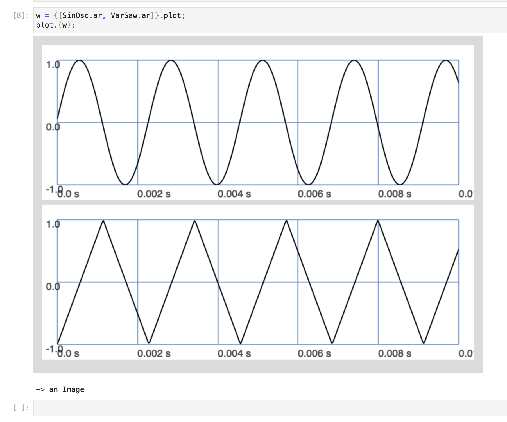
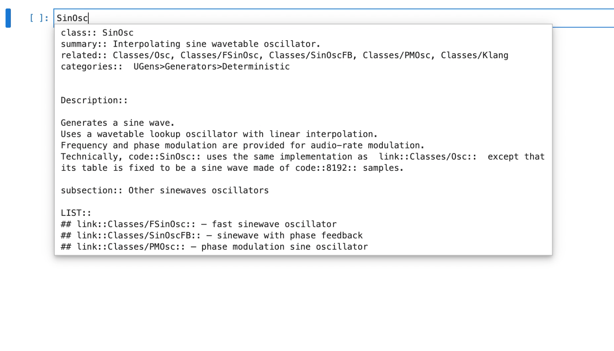

# Supercollider Jupyter Kernel

This kernel allows running [SuperCollider](https://supercollider.github.io/) Code in a [Jupyter](https://jupyter.org/) environment.


## Installation

Please make sure one has installed [SuperCollider](https://supercollider.github.io/) and
[Python 3 with pip](https://realpython.com/installing-python).

* To install the kernel for Jupyter execute

  ```shell
  pip3 install --upgrade sc-kernel
  ```

  This will also install [Jupyter Lab](https://jupyter.org/) if it is not already installed on the system.

* Start a new Jupyter Lab instance by executing `jupyter lab` in a console.

* Click on the SuperCollider icon

If one has not installed SuperCollider in the default location, one has to set a environment variable
called `SCLANG_PATH` which points to the sclang executable.

To uninstall the kernel execute

```shell
jupyter kernelspec uninstall sc_kernel
```

### As a Docker container

It is also possible to run sc-kernel in a Docker container, although a sound output is not possible in this case.
Assuming you have cloned the repository and opened a terminal in its directory.

```shell
# build container - takes some time b/c we build supercollider
docker build -t sc_kernel .
# run container
# -v mounts the current directory to the container
# -p passes the container port to our host
docker run -v ${PWD}:/home/sc_kernel -p 8888:8888 sc_kernel
```

## Usage

### Stop sound

Currently the `Cmd + .` command is not binded. Instead create a new cell with a single dot

```supercollider
.
```

and execute this cell. This will transform the command to `CommandPeriod.run;` which is what is actually called on the `Cmd + .` press in the IDE.

### Recording

`sc_kernel` provides an easy way to record audio to the local directory and store it embedded in the notebook
so one can transfer the notebook into a website which has the audio files included.

The audio is stored in FLAC with 16 bit resolution.

The provided function `record` takes 2 arguments:

* Duration in seconds
* Filename which will be used for the recording, using the path of the notebook as base path.

Assuming one has started the server, simply execute

```supercollider
Ndef(\sine, {
    var sig = SinOsc.ar(LFDNoise0.kr(1.0!2).exprange(100, 400));
    sig = sig * \amp.kr(0.2);
    sig;
}).play;

record.(4.0);
```


### Plotting

`sc_kernel` also provides a way to embed images of SuperCollider windows into the Jupyter document.
First create a window that you want to embed into the document

```supercollider
w = {SinOsc.ar(2.0)}.plot(1.0);
```

After the plotting is finished by the server we can now simply save an image of the window
to a file and also embed the image into the document via a SuperCollider helper method which is available.

```supercollider
plot.(w);
```



The image will be saved relative the directory where `jupyter lab` was executed.
The optional second argument can be the filename.

> Note that `{}.plot` does not return a `Window` but a `Plotter`, but `sc_kernel`
> accesses the window of a `Plotter` automatically.
>
> For plotting e.g. the server meter you need to pass the proper window, so
>
> ```supercollider
> a = s.meter;
> // a is a ServerMeter
>
> // new cell
> plot.(a.window, "meter.png");
> ```

### Autocomplete

Simply push `Tab` to see available autocompletions.
This is currently limited to scan for available classes.

### Documentation

To display the documentation of a Class, simply prepend a `?` to it and execute it, e.g.

```supercollider
?SinOsc
```

You can also hit `shift <tab>` iff the cursor is behind a class to trigger the inline documentation.



### Real Time Collaboration

Jupyter Lab allows for real time collaboration in which multiple users can write in the same document from different computers by visiting the Jupyter server via their browser.
Each user can write and execute sclang statements on your local sclang interpreter and the cursors of each user is shown to everyone.

This allows for interactive, shared sessions which can be an interesting live coding sessions.

> Be aware that this can be a security threat as it allows for other people from within the network to execute arbitrary sclang commands on your computer

To start such a session you can spin Jupyter Lab via

```shell
jupyter lab --ip 0.0.0.0 --collaborative --NotebookApp.token='sclang'
```

where the `NotebookApp.token` is the necessary password to login - set it to `''` if no password is wanted.

Check out the [documentation on Jupyter Lab](https://jupyterlab.readthedocs.io/en/stable/user/rtc.html) about *Real Time Collaboration*.

## Development

Any PR is welcome! Please state the changes in an Issue.
To contribute, please

* Fork the repository and clone it to a local directory

* Create a virtual environment and install the dev dependencies
  in it with

  ```shell
  pip3 install -e ".[dev]"
  ```

* If one wants to add the kernel to an existing Jupyter installation one can execute

  ```shell
  jupyter kernelspec install sc_kernel
  ```

  and run `jupyter lab` from within the cloned directory as
  we need to have access to `sc_kernel`.

* Run `./run_tests.sh` and make a PR :)
  Use `black sc_kernel test` to format the source code.

## Maintainers

* [Dennis Scheiba](https://dennis-scheiba.com)
