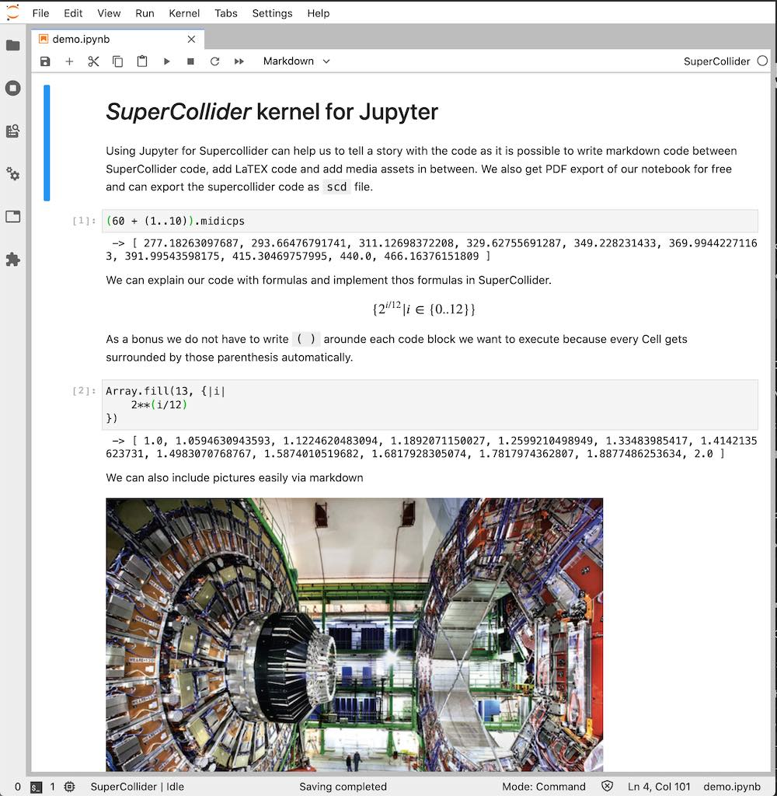

# Supercollider Jupyter Kernel

This kernel allows running SuperCollider Code in a [Jupyter](https://jupyter.org/) environment.



## Installation

* [Install JupyterLab](https://jupyter.org/install) and [SuperCollider](https://supercollider.github.io/).

* To install the kernel execute

  ```shell
  pip install git+https://github.com/capital-G/sc_kernel.git
  ```
  
  If you have not installed SuperCollider in the default location you have to set a environment variable
  called `SCLANG_PATH` which points to the sclang executable.

* Start a new Jupyter Lab instance by executing `jupyter lab` in a console.

* To uninstall the kernel execute

  ```shell
  jupyter kernelspec uninstall sc_kernel
  ```

## Usage

### Stop sound

* Currently the `Cmd + .` command is not binded. Instead create a new cell with a single dot
  
  ```
  .
  ```

  and execute this cell. This will transform the command to `CommandPeriod.run;` which is what is actually called on the `Cmd + .` press in the IDE.

## Installation / Development

* Clone the repository into a directory

  ```shell
  git clone git@github.com:capital-G/sc_kernel.git
  cd sc_kernel
  ```

* If one wants to add the kernel to an existing Jupyter installation one can execute

  ```shell
  jupyter kernelspec install sc_kernel
  ```

  and run `jupyter lab` from within the cloned directory as
  we need to have access to `sc_kernel`.

## Maintainers

* [Dennis Scheiba](https://dennis-scheiba.com)
